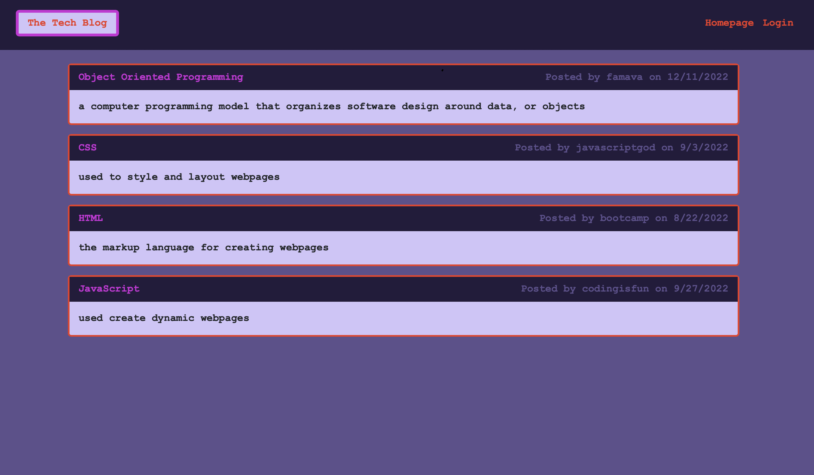

# the-dev-blog

[Deployed Application](https://salty-brushlands-60735.herokuapp.com)

## Description

This application was designed for developers to exchange ideas, knowledge, and tips by creating and commenting on blog posts. 

## Table of Contents

- [Installation](#installation)
- [Usage](#usage)
- [Credits](#credits)
- [License](#license)

## Installation

N/A

## Usage

When you visit the application, you will be directed to the homepage, which lists all the blog posts by our users. To use application yourself, you must first login or sign up by clicking on the "Login" tab.  Then, you will be able to view, create, update, and delete your own blog posts on your dashboard page. To comment on other developers' post, go to the homepage and click on that post.  To logout, click the "Logout" tab and refresh the page.
  
 

## Credits

N/A

## License

ISC